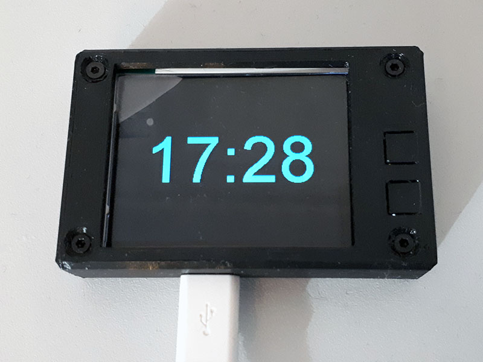
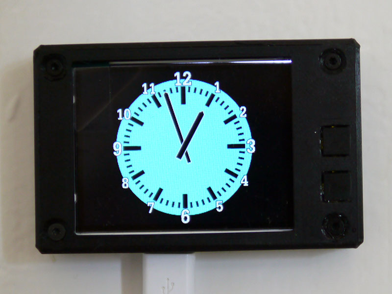
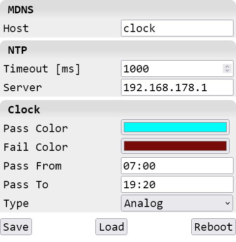

TTGO T4 Clock
=============

Simple clock using the TTGO T4 V1.3 development board.

See board [schema](etc/T4_v1.3.pdf) and [product page](https://www.lilygo.cc/products/t4).

<br/>

<br/>



Building
--------

The following dependencies are given.  
- C++14
- [PlatformIO](https://platformio.org/)
- [Arduino for ESP32](https://github.com/espressif/arduino-esp32)
- [TFT_eSPI](https://github.com/Bodmer/TFT_eSPI)
- [ESPNtpClient](https://github.com/gmag11/ESPNtpClient)
- [AsyncTCP](https://github.com/mathieucarbou/AsyncTCP)
- [ESPAsyncWebServer](https://github.com/mathieucarbou/ESPAsyncWebServer)
- [NanoSVG](https://github.com/memononen/nanosvg/tree/93ce879dc4c04a3ef1758428ec80083c38610b1f) (modified version included)
- [Unity](https://github.com/ThrowTheSwitch/Unity/) (for unit testing)

Adjust the system configuration in [`data/config.ini`](data/config.ini).

Optionally change the source code `src/main.cpp` for custom tweaks:
- `tftBl` - list of possible TFT brightness values (0..255) selectable via buttons
- `tftBlIndex` -  default TFT brightness as defined at this index in `tftBl`

To build and upload the filesystem and firmware:
```sh
pio run -t upload
pio run -t uploadfs
```

Once the firmware has been uploaded it is possible to use the Over the Air update function:
```sh
pio run -e ttgo-t4-v13-ota -t upload
pio run -e ttgo-t4-v13-ota -t uploadfs
```

Be sure to open the local firewall to allow python to perform:
- outgoing UDP connections to port 3232
- incoming TCP connections on port 3242

Changing the OTA password requires a serial update via `uploadfs`.

Testing
-------

The included unit tests can be executed like this:
```sh
pio test -e native
```

Make sure `g++` is in `PATH` and `gcovr` has been installed via:
```sh
pip install gcovr
```

The coverage report can then be found in `.pio/coverage/index.html`.

Debugging
---------

Access the serial port at 115200 bits/s and see if there is any error.

Use the one of the following commands to get the line numbers out of
the memory addresses from a crash dump:
```sh
python src/addr2line.py -e .pio/build/ttgo-t4-v13/firmware.elf <memory-addresses>
python src/gdb-addr2line.py -e .pio/build/ttgo-t4-v13/firmware.elf <memory-addresses>
```

Add `log_e("printf() like format string")` commands within the code to
get more details on the serial port during execution.

Housing
-------

A simple case is provided as 3D printable files.
- [etc/case.FCStd](etc/case.FCStd) - FreeCAD construction file
- [etc/case-Bottom.stl](etc/case-Bottom.stl) - bottom part of the case for 3D printing
- [etc/case-Top.stl](etc/case-Top.stl) - top part of the case for 3D printing

Use the given orientation for printing and the following parameters:
- layer height: 0.2mm
- infill: ≥15%
- solid layers: ≥5 top, ≥4 bottom
- perimeters: ≥3
- supports: none

Required for assembly:
- 4x M2x12mm countersink screws

There is no need to create threads for the screws if the housing has been
printed with the correct tolerance.

Development Tools
-----------------

The following SW tools have been used for development:
- [PlatformIO](https://platformio.org/)
- [Git for Windows](https://git-scm.com/download/win)
- [GCC](https://gcc.gnu.org/)
- [MSys/MINGW](https://sourceforge.net/projects/mingw/)  
  recommended is [MSys2](https://www.msys2.org/)
- [Inkscape](https://inkscape.org/)
- [FreeCAD](https://www.freecad.org/)
- [PrusaSlicer](https://github.com/prusa3d/PrusaSlicer)
- [Notepad++](https://notepad-plus-plus.org/)
- [Python](https://www.python.org/)
- [gcovr](https://gcovr.com/)
- [pylint](https://github.com/pylint-dev/pylint)
- [Firefox](https://www.mozilla.org/firefox/)
- [PuTTY](https://www.chiark.greenend.org.uk/~sgtatham/putty/latest.html)
- [RGB565 Color Picker](https://rgbcolorpicker.com/565)
- [SVG Optimizer](https://jakearchibald.github.io/svgomg/)

Note that these are only listed here for reference.

Software Design Decisions
-------------------------

The following software design decisions have been made.

### Display

- Use of NanoSVG for analog clock rendering for high quality image output, easy integration and good access to internal structures for animation.
- Copy original SVG paths for clock hands before rotation and copy them back afterwards to avoid accumulation of rounding errors over time.
- Update of clock only after state change to avoid flickering.
- Single time initialization of all SVG related objects to avoid sporadic issues during memory allocations.

### Configuration

- INI configuration as the one and only input format for easy configuration and single point of failure.
  Extensive unit tests have been added to ensure correct operation for every corner case.
- Use of LittleFS instead of SPIFFS for better flash wear leveling.
- Delayed configuration update on file system when configured via Web GUI to avoid fast flash degeneration.
- Multi-level configuration verification for early error detection (within PlatformIO, via JavaScript on Web GUI and within C++ code).

### Networking

- Use of MDNS for zero configuration access from local network by name.
- Use of asynchronous web server instead of single client, synchronous web server for better handling of REST API.

### Dependencies

- Use of `ESP Async WebServer` and `Async TCP` from `mathieucarbou` as those versions seems to be the most maintained ones.
- Only use of freely available tools and as few dependencies as possible. This avoids license issues and makes the project more accessible.

License
-------

See [LICENSE](LICENSE).  
